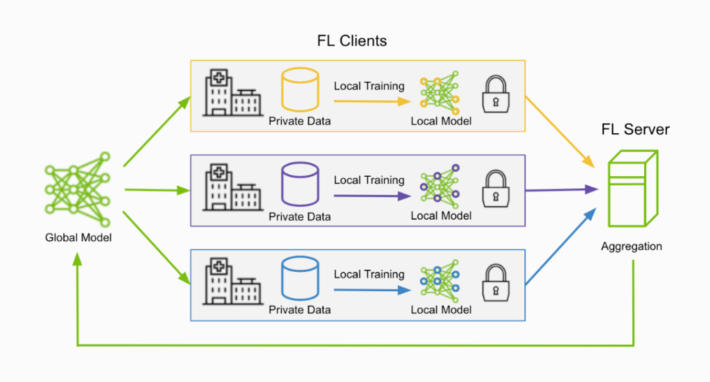
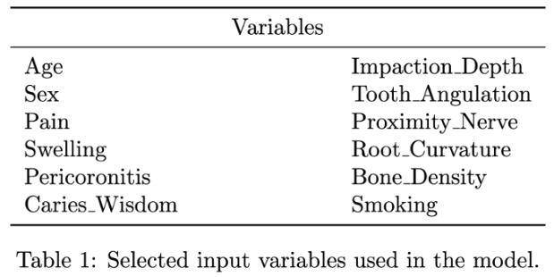
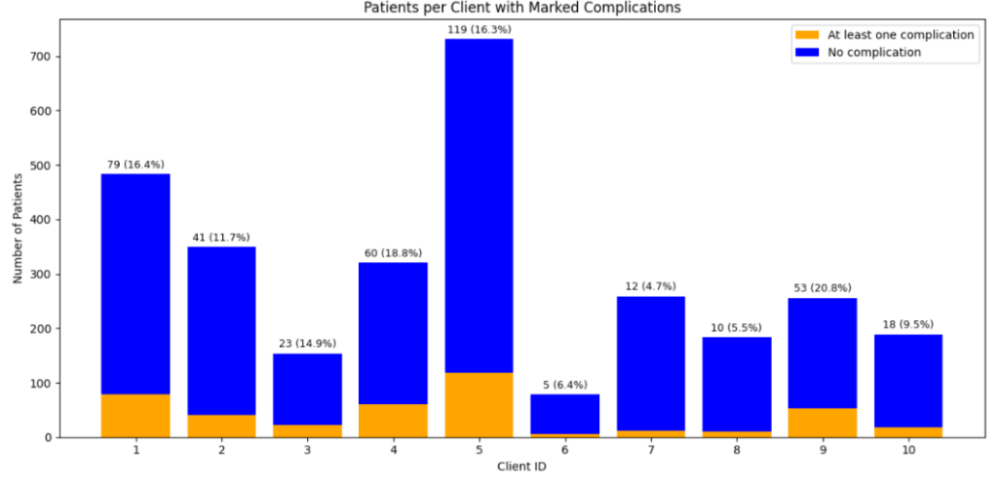
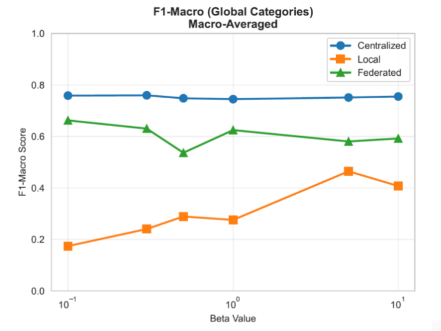

# Federated Dental Risk Prediction

Jonas Westergaard, Mejse Linderoth, Oskar Johnsen

Note that this project was taken over from a germen guy named Jonas, who will be reffered by his github accountname "Smoothy". 

# Documentation

| Document | Description |
|---|---|
| [Installation Guide](docs our/InstallationGuide.md) | Installation and environment setup |
| [Results](docs our/Results.pdf) | Experimental results |
| [READMEORIGINAL](docs smoothy/READMEORIGINAL.md) | Original README from the repository before we took over the project |
| [Notes for Ourselves](docs our/notes-for-ourselves.pdf) | Notes and additional information related to the project. |
---

# Project Structure

Legend:

- 🟢 Developed by us
- 🟡 Modified or extended by us
- ⚪ Original / mostly unchanged

```text
Federated-dental-risk-vol2/
├── 🟡 checkpoints/          # Model checkpoints
├── 🟡 configs/              # Configuration files
├── 🟡 data/                 # Generated datasets and results
├── 🟢 docs our/             # Documentation and setup guides
├── ⚪ docs smoothy			# Original Documentation and setup guides
├── 🟢 Groundwork/           # Groundwork and preliminary material
├── 🟢 images/               # Figures used in README and documentation
├── ⚪ notebooks/            # Jupyter notebooks / exploratory analysis
├── ⚪ scripts/              # Utility and visualization scripts
├── 🟡 src/
│   ├── 🟢 analysis/         # Analysis and experiment code
│   ├── ⚪ core/             # Core utilities and shared functionality
│   ├── 🟡 data_generation/  # Synthetic dataset generation pipeline
│   └── 🟡 ml/               # Machine learning and federated learning pipeline
├── ⚪ wandb/                # WandB logs and experiment tracking
├── ⚪ .gitignore
├── ⚪ pyproject.toml
└── 🟢 README.md
```

A detailed overview of which parts that were developed or modified by us can be found here: [Project Contribution Overview](docs our/project_contribution_overview.md)

---

# Project Deskription

**Note:**  
This project description was written on 06-03-2026 and therefore does not fully reflect the current state of the project. Several additional methods, experiments, and analyses have since been implemented. For a more up-to-date overview of the work completed, see the [Results](docs our/Results.pdf) document.

The overall purpose of this project is to predict the probability of four complications after extraction of third molars (wisdom teeth). These complications are nerve damage, Alveolar osteitis (dry socket), secondary infection, and excessive bleeding. A key challenge is that clinical data is spread across many dental clinics. Laws regarding data protection such as GDPR prevent data from being collected in one central database. Therefore it is not possible to train a traditional centralized machine learning model. To address this, we explore federated learning, where models are trained locally at each clinic and only model weights —not patient data—are shared. The performance of the FL-method is compared to a centralized model and the average performance of locally trained models.

<p align="center">
  
</p>

<p align="center">
  <em>Figure 1: Overall federated learning setup.</em>
</p>

The figure above illustrates the overall federated setup used in this project. A global model is initialized on a central server and distributed to participating clients. Each clinic then trains the model locally on its own data and sends the updated model parameters (weights) back to the server. The server aggregates these updates using an aggregation method (determining which method to use is part of our project). The aggregated weights form a new global model, which is then redistributed to the clients. This process is repeated for several federated rounds (default is 6 federated rounds).

At each clinic, the model that is trained locally is a multilayer perceptron (MLP) implemented in PyTorch. The model takes patient characteristics as input and predicts the probability of the four complications. The neural network consists of an input layer with 30 patient features after preprocessing, followed by two fully connected hidden layers with 128 and 64 neurons. The two hidden layers use ReLU activation functions. Dropout regularization is applied between layers to reduce overfitting. The final layer has one output neuron for each complication, and the model outputs probabilities using a sigmoid activation function. During training, the model is optimized using binary cross-entropy with logits.

In addition to predicting complication probabilities, the predicted risks are mapped into three categories: low, mid, and high risk using either global or local percentile thresholds (33rd and 67th percentiles). This is because the complications are rare events, meaning that the observed binary outcomes contain substantial noise (see section "Data generation"). In the data generation process, complications are sampled from the underlying risk probabilities, so even patients with relatively high risk will often have no complication in the data. As a result, evaluating models directly on binary outcomes becomes unstable, and a naive model that always predicts no complication could achieve high accuracy. By evaluating predictions of the risk categories instead (using metrics like F1 macro score), the evaluation reflects whether the model correctly ranks patients by risk rather than the unstable binary outcomes.

---

## Data generation

The data we work with in the project is simulated. A previous part of the project has been to develop a code that generates the data. The datapoints correspond to patients that have undergone a third molar extraction surgery. The data generation process starts by generating people with demographics and characteristics that mimics those of the real world. Below is an excerpt of some of these variables:

<p align="center">
  
</p>

<p align="center">
  <em>Table 1: Selected input variables used in the model.</em>
</p>

Using knowledge from literature and clinical experts these characteristics are used to calculate a complication risk. The foundation of these calculations is that we have a base risk (the base incidence of the complication). We then multiply this base risk if a generated person has a characteristic that makes them more or less likely to get a complication. When the risk is calculated we draw from a uniform distribution in order to (randomly, but based on the probability) generate whether or not a simulated person gets the complication. This of course introduces stochasticity and noise in the data. Using the percentiles of the risk distribution we partition the data points into low, mid and high categories.

---

## Data partitioning

From here data can be partitioned into clients to simulate the real-world scenario of having different dental clinics. This is done using a Dirichlet distribution. A parameter in the Dirichlet distribution is β, which controls how skewed the distribution is. Bigger values result in more skewed data and smaller values result in more uniformly distributed data. We have two different beta-parameters: One controlling distribution of data amount across clients and one controlling amount of positive cases (of complications) across clients. Below we have a figure illustrating this.

<p align="center">
  
</p>

<p align="center">
  <em>Figure 2: Distribution of datapoints and complications across clients.</em>
</p>

Here we see that the data is not evenly distributed across clients - neither in terms of number of datapoints or number of positive cases. This leads us to what we are specifically working on right now:

---

## What we are working on now

### Beta sweep

Since we do not have access to the real world data we do not know what the real distribution of the data is. We therefore want to train and evaluate our model for many different data-configurations, across different levels of IID-ness, in order to make sure that our model works well for all possible combinations of distributions. This gives us information about when the model performs well and when it performs worse and should thus be trusted less.

We want to train and evaluate a model for a 2-dimensional grid of possible combinations of β-values. For each combination of β-values we train both a centralized, a federated and a local model.

We track the performance of the federated model relative to both the centralized and the local models. The centralized model serves as an upper benchmark, as it is trained on the full dataset without any data partitioning. Using the beta sweep we can track performance across beta configurations, where our goal is to optimize the federated model to have a performance close to that of the centralized model. The figure below shows our current performance across a common β-value (beta quantity and beta label is equal) with FedAvg as an aggregation method (See next section).

<p align="center">
  
</p>

<p align="center">
  <em>Figure 3: Current beta sweep performance results.</em>
</p>


We also want to try to isolate the effects of changing just one of the β-values, thereby finding the impact of a label skew alone or a quantity skew. In addition, we examine potential interaction effects between the two types of heterogeneity.

---

## Aggregation methods

The aggregation method currently in use is a method called FedAvg, which is just a weighted average, with the weights corresponding to the number of patients per clinic. We have also implemented another method called balanced average, where the weights correspond to the number of cases per clinic that experienced a complication. There are also other more complicated aggregation methods that could be used, and this is something we want to investigate further. There might be some aggregation methods that work better when the data is more or less IID, and we want to find out which methods work well with which data. We are in contact with someone who knows more about this field, and he has suggested a method called FedProx and possibly one called FedSGD.

To do this we plan to implement different aggregation methods, and do a beta-sweep for each of them, and thereby find out which are the best methods for which data-configurations.

---

## Long term plans

It is still unclear how long the already mentioned implementation will take, so we do not know if we will have time for more than this. If we have the time, we plan to investigate methods for updating the trained model sequentially as new data becomes available, allowing the model to incorporate newly observed cases without requiring a full retraining.

---

